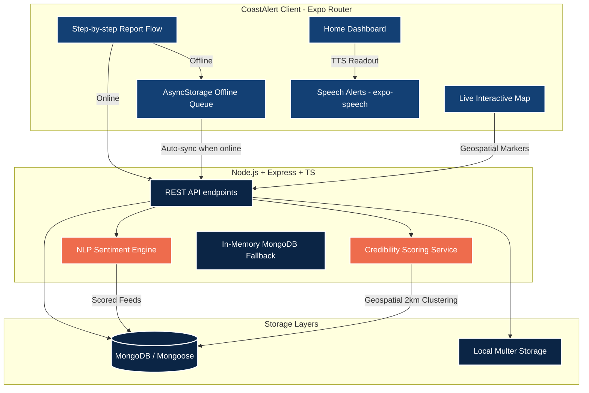

# CoastAlert 🌊
> **Community-powered ocean hazard intelligence**
>
> Built for **HACKHAZARDS '26** (Expo Track) | Solving Ministry of Earth Sciences (MoES) / INCOIS Problem Statement **SIH25039**

CoastAlert is a full-stack crowdsourced ocean hazard reporting and social media analytics mobile platform. It bridges the gap between citizens (fishermen, coastal residents) and official monitoring bodies like the Indian National Centre for Ocean Information Services (INCOIS). The system automates community report aggregation, geospatial clustering verification, push alerts, and simulated social media NLP sentiment analysis.

---

## 🏗️ System Architecture



---

## 🛠️ Tech Stack & Key Features

### Frontend (Expo Router)
- **State & Contexts:** Clean state separation using React Contexts:
  - [AuthContext](file:///c:/Users/Nishant%20Gaurav/Downloads/expo%20app/mobile/contexts/AuthContext.tsx) (Session & Role handling).
  - [LanguageContext](file:///c:/Users/Nishant%20Gaurav/Downloads/expo%20app/mobile/contexts/LanguageContext.tsx) (Dynamic English / Hindi translations).
  - [ThemeContext](file:///c:/Users/Nishant%20Gaurav/Downloads/expo%20app/mobile/contexts/ThemeContext.tsx) (Sunlight-readable dark/light mode toggle).
  - [OfflineReportContext](file:///c:/Users/Nishant%20Gaurav/Downloads/expo%20app/mobile/contexts/OfflineReportContext.tsx) (AsyncStorage local queue with auto-retry sync).
  - [NotificationContext](file:///c:/Users/Nishant%20Gaurav/Downloads/expo%20app/mobile/contexts/NotificationContext.tsx) (OS Push notifications registration and alerts scheduler).
- **Notification Center:** Accessible from Home header with unread badge overlay. Shows a log of active local push warnings.
- **Interactive Maps:** Geospatial plotting using `react-native-maps` with dynamic severity pins and slide-up report detail drawers.
- **Accessibility:** 44x44pt touch targets, high-contrast emergency coloring, and Text-to-Speech alert readouts using `expo-speech`.
- **Fisherman Voice Input:** Simulated Speech-to-Text mic button on report details form to capture descriptions verbally.

### Backend (Node.js REST API)
- **Automatic DB Fallback:** Runs out-of-the-box. If the system does not detect a running local MongoDB instance on port `27017`, it automatically spins up an in-memory database (`mongodb-memory-server`) and populates it with all seed data dynamically on boot.
- **Anonymous Reporting Support:** Backend model schemas permit saving hazard reports with guest authentication credentials (`reportedBy` is optional).
- **Geospatial Proximity:** Implements `$near` coordinates queries within 100km of the user.
- **Credibility Scoring Engine:** Automatically calculates report credibility based on photo evidence, community "I saw this too" confirmations, and geospatial proximity clustering (another report of the same hazard within 2km and 1 hour).
- **Simulated NLP Sentiment Engine:** Flagging hazard tweets and posts from a mock social feed by calculating keyword density and sentiment score (using `sentiment` library from npm).

---

## 🚀 Getting Started

### Prerequisites
- [Node.js](https://nodejs.org) (v18+ recommended)
- [Expo Go App](https://expo.dev/client) installed on your mobile device (to scan the QR code and run the app)

---

### Step 1: Run the Backend API

1. Navigate to the backend folder:
   ```bash
   cd backend
   ```
2. Install dependencies:
   ```bash
   npm install
   ```
3. Run compilation check & start the dev server:
   ```bash
   npm run dev
   ```

> [!NOTE]
> On server boot:
> - If you have MongoDB running locally, it will connect to `mongodb://127.0.0.1:27017/coastalert`.
> - If MongoDB is offline, it spins up `mongodb-memory-server` in-memory and automatically seeds it with users, 10 hazards, INCOIS alerts, and NLP parsed social feeds.
> - The API server starts on **Port 5000**.

To run backend tests manually:
```bash
npm run test-api
```

---

### Step 2: Run the Expo Mobile App

1. Navigate to the mobile folder:
   ```bash
   cd ../mobile
   ```
2. Install dependencies:
   ```bash
   npm install
   ```
3. Start the Expo bundler:
   ```bash
   npx expo start
   ```
4. Scan the QR code with your phone (using Expo Go on Android or Camera app on iOS).

> [!TIP]
> - **Testing on Physical Devices:** When running on a physical phone via Expo Go, you need to point the app to your computer's local IP address instead of `localhost`. 
> - Go to the **Profile tab** inside the mobile app, scroll to the bottom, type your computer's IP address (e.g., `http://192.168.1.15:5000`) in the **Server URL** input box, and tap **Save**.

---

## 👥 Demo Logins (Seed Data)

You can log in to the app with any of these pre-seeded accounts:

| Role | Name | Phone Number | Password |
|---|---|---|---|
| **Citizen / Fisherman** | Ramesh Prasad | `9876543210` | `password123` |
| **Volunteer / Lifeguard** | Priya Sharma | `8765432109` | `password123` |
| **Analyst (Admin Console)** | Dr. S. K. Nair | `7654321098` | `password123` |

*Logging in as the Analyst unlocks the hidden **Admin Tab** on the bottom tab bar, where you can audit pending reports, promote them, or dismiss them as "False Alarms".*

---

## 💾 Switching to Real Persistent Database (MongoDB Atlas / Local)

By default, the backend connects to an in-memory database to make it run out-of-the-box for quick demos without requiring setup. If the server restarts, this temporary data is reset.

To switch to a permanent database where all your test data is persistent:
1. Make sure your local MongoDB service is running (on port `27017`) **OR** obtain a connection string from MongoDB Atlas.
2. In the `backend/` directory, open `.env` (copy from `.env.example` if it doesn't exist).
3. Set your connection string in the `MONGODB_URI` environment variable, e.g.:
   ```env
   MONGODB_URI=mongodb+srv://<username>:<password>@cluster.mongodb.net/coastalert
   ```
4. Start the backend: `npm run dev`. The server will detect the active connection string, connect directly to your persistent instance, and skip loading the in-memory fallback.

---

## ⚠️ Windows Path with Spaces Warning

The current workspace path `c:\Users\Nishant Gaurav\Downloads\expo app` contains a space.
* **Local Development:** Running the project with `npx expo start` and loading the bundle via **Expo Go** works perfectly and is fully supported with spaces in directory paths.
* **Production Native Builds:** If you wish to compile standard production APK or IPA binaries using Android Studio / Gradle (`npx expo run:android`), path spaces can trigger syntax errors in some JDK toolchains. If you plan to make a production build, it is recommended to copy the project to a path without spaces (e.g., `C:\CoastAlert`).
